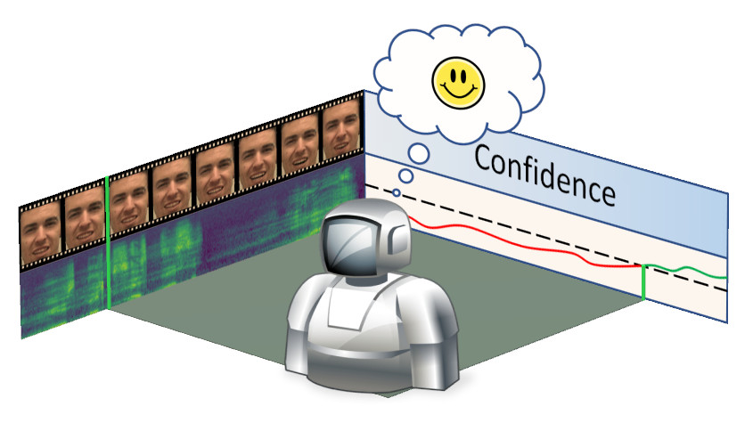
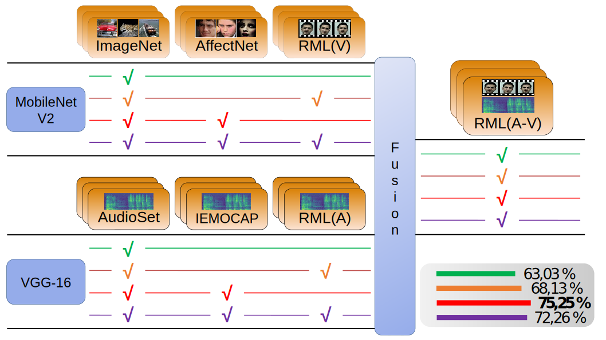
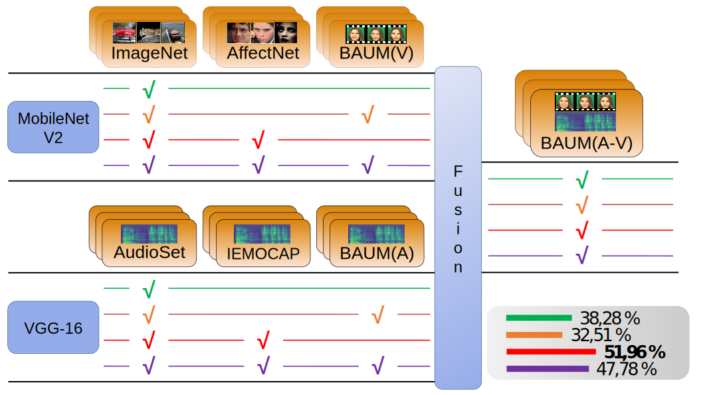
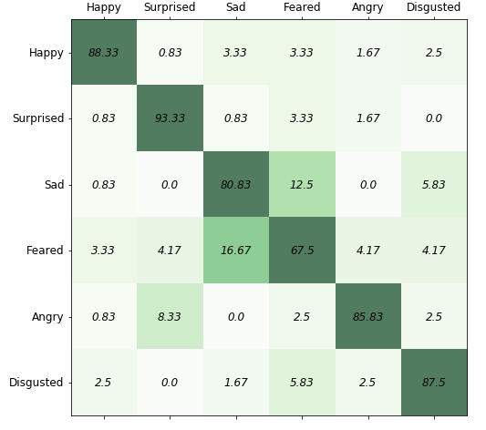
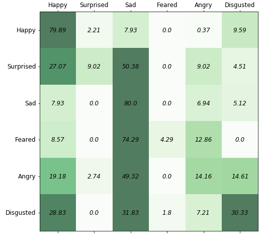

<p align='right'>
	
	<h1>
    	An Active Learning Paradigm for Online Audio-Visual Emotion Recognition
	</h1>
</p>

This repository contains the **official code** for developing an online emotion recognition classifier using audio-visual modalities and deep reinforcement learning techniques introduced [here](https://ieeexplore.ieee.org/document/8937495).

Combined with corresponding repositories for preprocessing unimodal and multi-modal emotional datasets, like [AffectNet](http://mohammadmahoor.com/affectnet/), [IEMOCAP](https://sail.usc.edu/iemocap/), [RML](http://shachi.org/resources/4965), [BAUM-1](https://archive.ics.uci.edu/ml/datasets/BAUM-1), to produce the papers results.

Preprocessing codes for AffectNet, IEMOCAP and RML are provided by the authors, [here](https://github.com/IoannisKansizoglou/AffectNet-preprocess), [here](https://github.com/IoannisKansizoglou/Iemocap-preprocess) and [here](https://github.com/IoannisKansizoglou/RML-preprocess), respectively.

If you find this repository useful in your research, please consider citing:

    @article{kansizoglou2019active,
      title={An Active Learning Paradigm for Online Audio-Visual Emotion Recognition},
      author={Kansizoglou, Ioannis and Bampis, Loukas and Gasteratos, Antonios},
      journal={IEEE Transactions on Affective Computing},
      year={2019}
    }

### Prerequisites

* Vggish weights converted to PyTorch from [this](https://github.com/tcvrick/audioset-vggish-tensorflow-to-pytorch) repository and included in ```./data/weights/``` path with name ```pytorch_vggish.pth```.

* Provided code is tested in Python 3.7.4 and Pytorch 1.4.0.

### Key Notes from Paper

### Results

* Training Strategies

<p align='center'>
	
	
</p>
<div><br><br><br><br><br><br><br><br><br><br><br><br></div>

* Confusion Matrices

<p align='center'>
	
	
</p>
<div><br><br><br><br><br><br><br><br><br><br><br><br><br><br><br><br></div>

<table style="width:100%" style="border-collapse: collapse; border: none;">
  <tr>
    <td></td>
    <td></td>
  </tr>
  <tr>
    <td>**(a) RML dataset**</td>
    <td>**(b) BAUM-1s dataset**</td>
  </tr>
</table>

### Inputs Format

The ```params.json``` sets the training hyper-parameters, the exploited modality from the set ```{"audio", "visual", "fusion"}``` and the name of the speaker that is subtracted from the training dataset for evaluation. Note that *Leave-One-Speaker-Out* and *Leave-One-Speakers-Group-Out* schemes are adopted. The names of the two files shall be **training_data.csv** and **evaluation_data.csv**

The following models are trained through two .csv files, including the paths of the training and evaluation samples, respectively. Those files shall be stored inside ```./data/speaker_folder```, where ```speaker_folder``` shall be given to the ```"speaker"``` variable in the ```params.json``` file.

### Usage

Run ```python3 main.py train``` or simply ```python3 main.py``` to train the model.

In order to test the model on the validation data run ```python3 main.py test```.
